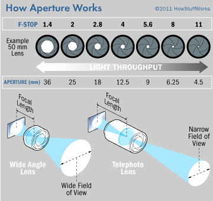
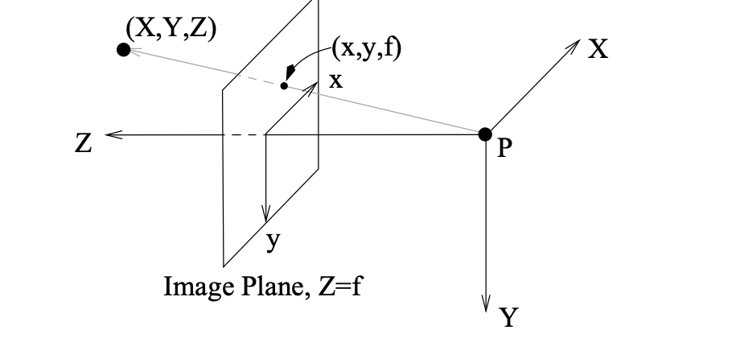
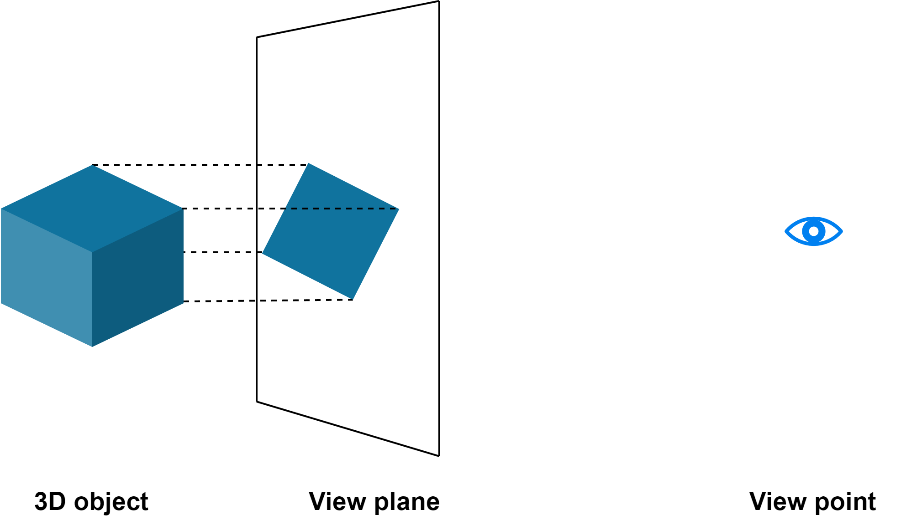

Images project onto a surface/plane through light rays reflecting on the object. We view light that has reflected onto a point of the object and landed on a point of the plane.

## Aperture
If we just tried to view the rays of light normally, we wouldn't be able to see anything due to how the multiple rays of the object landing in the same spot, creating some blurry/non recognizable image of the object

Appetures are a way of focusing the rays of light from the objects into particular points.

### How they work
Apertures are holes that alllow and block rays of light to reach the canvas/image plane. This allows us to control which and how many rays of light can reach the canvas. Normally focus lens are added on top to ensure that the rays of light that enter focus to a point.

## Projections
There are two types of projections:
**Perspective**: A projection from a point on the image plane to the center of projection (camera/ or eye)
**Parallel**: A projection from a point on the image plane in a direction perpendicular to the image surface

### Perspective Projection

The goal is to project your point (in this case (X,Y,Z)) onto the image plane. We see that as we move towards the center of project (P) the point (X,Y,Z) gets scaled down in all dimensions. 

The distance of the point to the center of projection is represented by the Z-coordinate since we consider the center of projection to always be (0, 0, 0). Now if we projected the points onto an image plane at the center of projection, all of our points would be at (0, 0, 0).

This is where the focal length $f$ come in. This represents the distance from the center of projection to the image plane, so instead of the points being projected at Z = 0, they are projected at Z = f

With that we want to scale down the point's Z position to be the focal length position

$$
\begin{bmatrix}
            x \\
            y \\
            f
\end{bmatrix}
=
\frac{f}{Z} 
\begin{bmatrix}
            X \\
            Y \\
            Z
\end{bmatrix}
=
\begin{bmatrix}
            X * \frac{f}{Z} \\
            Y * \frac{f}{Z} \\
            Z * \frac{f}{Z}
\end{bmatrix}
$$
This then generates the now projected version of our original point for the specific image plane

### Parallel Projection

There is no scaling done to primitives when doing parallel projection. Instead of projecting to a center of projection like with perspective, you project parallel to the image plane

