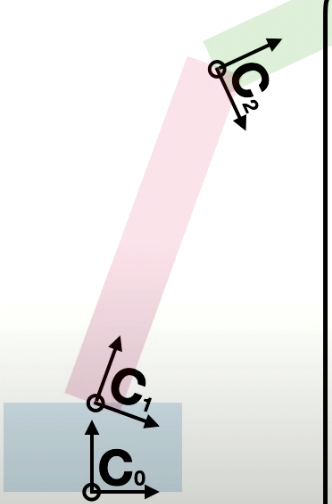
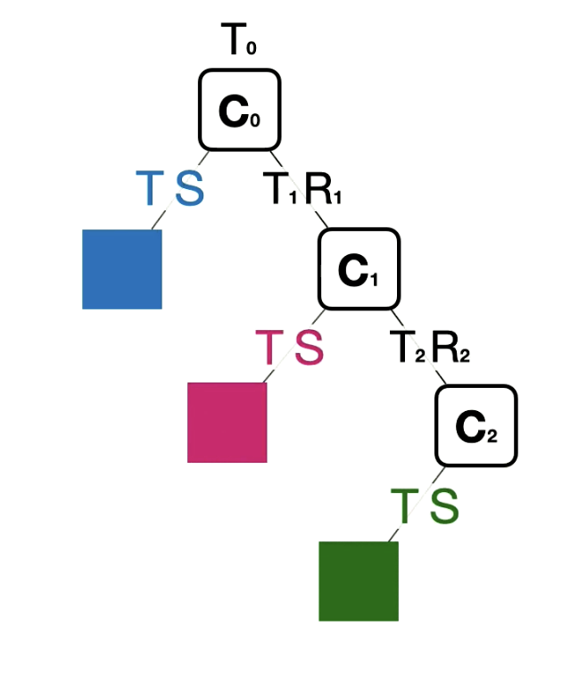
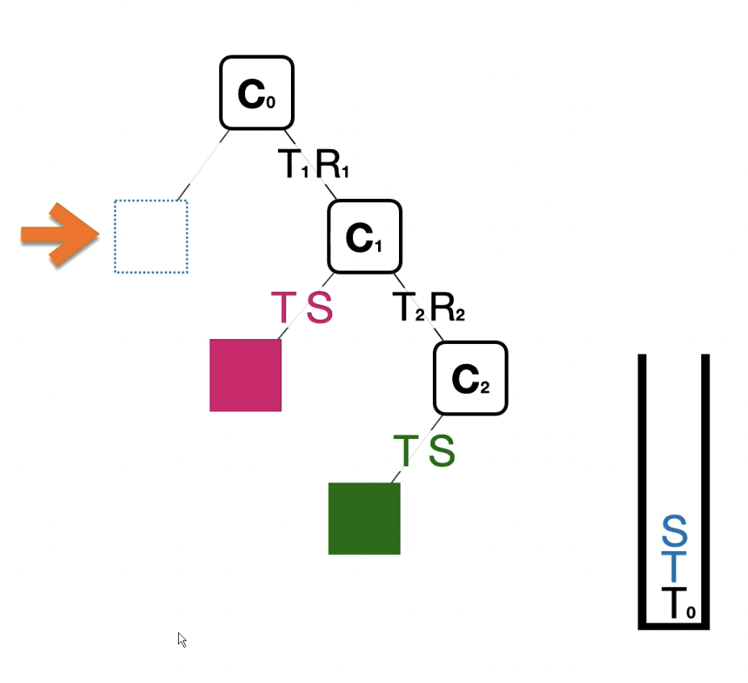
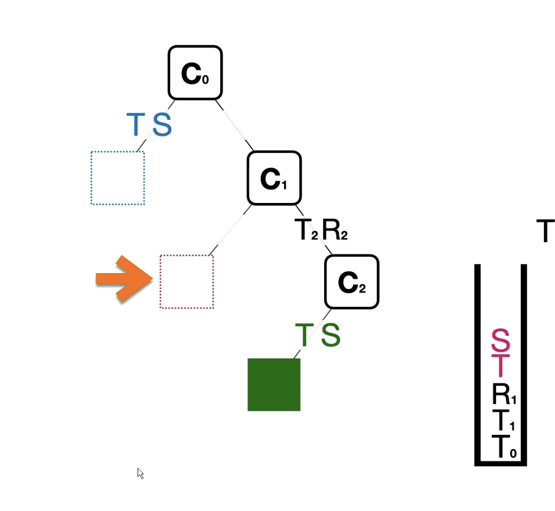
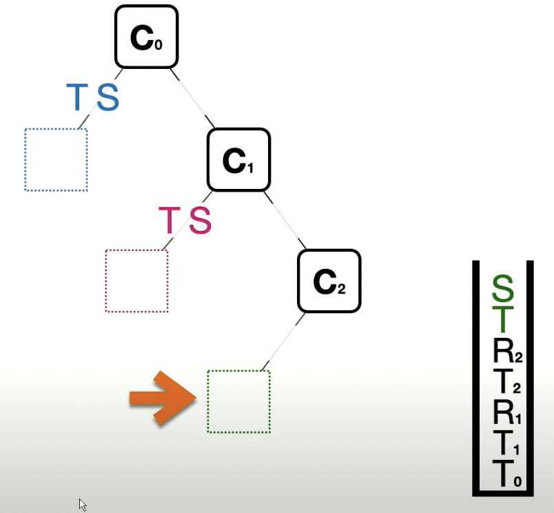

## Matrix Transformation 
The reason we keep things like translations as a matrix transformation instead of a simple collumn addition is for **EFFICIENCY**.

If we wanted to do multiple transformations on an objects.

$$(M_N * ... * M_1) * P $$

is easier than

$$(M_2 * ((M_1 * P ) + T_1) + T_2)$$

We can calculate the overall matrix onces instead of doing multiple computations for multiple points

### Types of transformation
$$T(x,y,z) = Translation$$
$$S(x,y,z) = Scaling$$
$$Rx(theta) = \text{Rotation over x-axis}$$
$$Ry(theta) = \text{Rotation over y-axis}$$
$$Rz(theta) = \text{Rotation over z-axis}$$

### Example of transformation

Let's say we want to rotate an object ϴ on a 2D plane with a point P as it's rotation pivot:
1. You want to first translate the object to have point P of the object be at the origin (anything at the origin will not be affected during scaling, translation, or rotation)
	1. $$T(-p.x,-p.y,-p.z) = P $$
2. Next you want to do a rotation around the z-axis (since we are in 2D)
	1. $$Rz(ϴ) * T(-p.x, -p.y, -p.z) = P$$
3. Finally you want to move the object back to its original position
	1. $$T(p.x, p.y, p.z) * Rz(ϴ) * T(-p.x, -p.y, -p.z) = P$$

*Note: Matrix operations go right to left, you need to order the matricies in the order of the transformations correctly*

## Hierachical Models
With most models, we want certain objects to move similar to joints, where they move if a parent object moves. This is a form called **Hierachical modeling**

You can view it like this:
- World
	- Body
		- Arms
			- Hands
				- Fingers
		- Head
			- Ears
			- Eyes

You can view this as a tree of different matrix transformations

### Coordinate Frames
You can imagine a coordinate frame as a screenshot of the coordinate system/unit vectors transposed and rotated in some fashion.

In a hierachical system, each parent-child relationship comes with a coordinate frame that dictates the world view of the particular object

In a hiearchy, a coordinate frame is made up from the previous coordinate frames from the parents above.

In the above example:
$$C_0 = T_0$$
$$C_1 =  T_1 * R_{x_1}(\theta) * C_0$$
$$C_2 =  T_2 * R_{x_2}(\theta) * C_1$$

Each object uses their own coordinate frame to determine the position of their pixels

$$\text{Blue} = C_0 * T * S$$
$$\text{Red} = C_1 * T * S$$
$$\text{Green} = C_2 * T * S$$

With these, if a parents moves in someway, the children will also be affected by them.

Another way to view the relationships is like this:

Now to actually do the math to create these objects, you need to create the overaching matricies multipled with the points of the object.

### Generating the hierachical matrix

You can view this process as a in-order traversal/DFS using a stack. The stack represents the current overall matrix while you push and pop mini transformation components.

1. We start with generating the blue block by adding the first coordinate frame into the stack and then adding the block's independent transformations into the stack. 

2. We then remove the independent transformations of the blue block and add in the additional transformations that make up our next coordinate frame. We then add in the independent transforations of the red block

3. We then perform the same steps, remove independent transformations -> create next coordinate frame, add in new independent transformations

