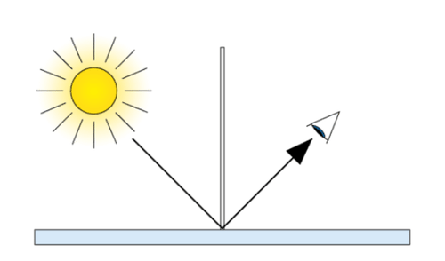
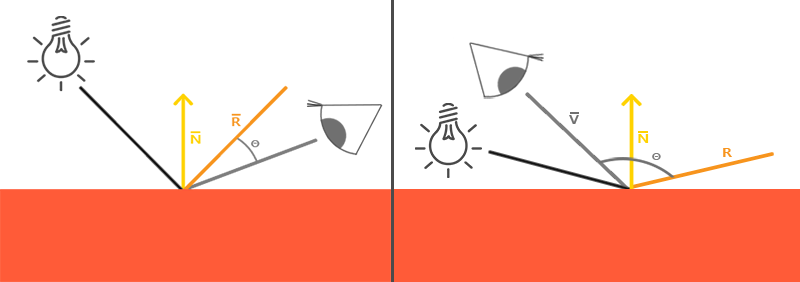
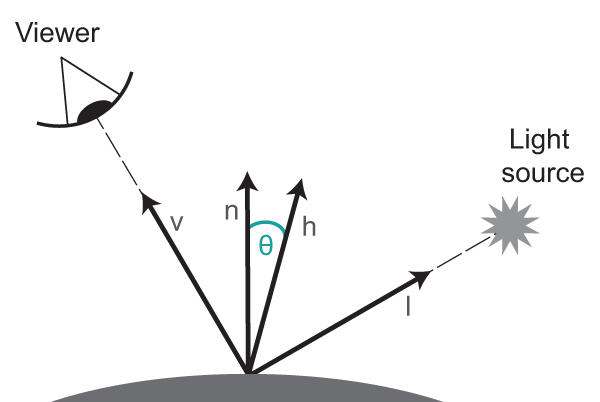
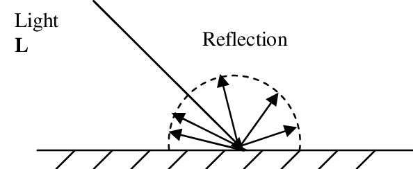
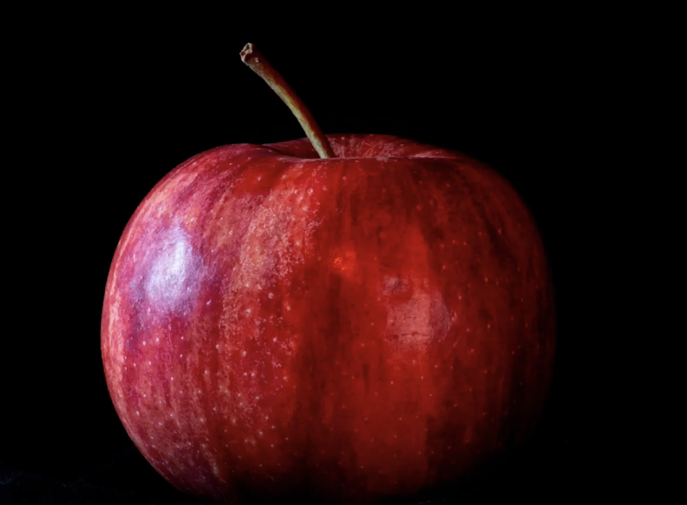

Naturally photons/light bounces on impact with surfaces, but how does it bouce off?

# Mirrors/Light Models
Mirros are the best example of how light reflects, when something is viewed through a mirror it is flipped along the z-axis

In terms on how to calculate the light reflected to a view, there are many different types of light reflection models

### Variables
$I_V =$ Light intesity for viewer

$I_L =$ Light intensity from source

$V =$ Viewing vector

$R =$ Reflection vector

$N =$ Normal Vector

## Phong Reflection (Specular)

This uses the reflection of the light vector and the angle between the reflection and the veiwing vector to determine the intensity of light that the camera/viewer sees

$I_V = I_L * (V \cdot R)^a$

## Blinn-Phong (Specular)
Instead of using the angle between the reflection and viewer, Blinn-Phong uses the angle between the half vector of the light vector and view vector ($H = L + V$)
$I_V = I_L * (N \cdot H)^a$

## Lambertian Reflection(Diffuse)
This type of reflection represents when light equally gets spread in all directions in oppose to the other light models that represent when light gets spread unevenly depending on the viewing angle

$I_O = I_L * N \cdot L$

## Ambient Light
Ambient light is the light that exists after infinite amounts of reflections. You can view it as the "light in the room". Since it is a result from infinite amounts of reflections, it is normally treated as a predefined constant

# Diffuse & Specular
To make it clear, diffuse light models focus on when light on impact spreads evenly in all directions while specular focuses on when light is spread more intense in certain directions. 

This is not a 1 or the other phenomenon. These light models(specular & diffuse) both happen at the same time in real life. For example an apple refuses to absorb the color red and spreads it out evenly in all directions, but the layer of wax around it just reflects the light specularly. We have both specular light and diffuse light happening at the same time!

# Light Model
Since we know that light is the combination of ambient, specular, and diffuse lighting, we can view the equation for light to be like this:

$I = I_{La} + I_L * (N \cdot H)^a + I_L * (N \cdot L)$
$I_{La}$ = Ambient light Inensity

Light is additive, meaning multiple lights just get added together

$I = I_{La} + \sum_{j} I_{L_{j}} * (N \cdot H_{j})^a + {I_L{_j}} * (N \cdot L_{j})$ 

There are also specific scalers that define the properities of the object used in the light model
$k_d=$ diffusal color
$k_s=$ specular color
a = specular shininess

$I = I_{La} + \sum_{j} k_s * I_{L_{j}} * (N \cdot H_{j})^a + k_d *{I_L{_j}} * (N \cdot L_{j})$ 

## Attenuation
To add on to the light model, light follows a pheonomenon known as the *Inverse Square Rule*. This rule is as light spreads farther out from the source, the intesnity of it decreases inversly of the square distance

$I_L = \frac{I_{s}}{4 * \pi * r^2}$

$s=$ source
$r$ = radius from source

Attenuation is a variation of the inverse square rule that lets us define an approximation of the intensity decay

$I_L = \frac{I_{s}}{ar^2+br + c}$
$a$, $b$, $c$ are constants that can be changed to fit the right intensity decay model desired 