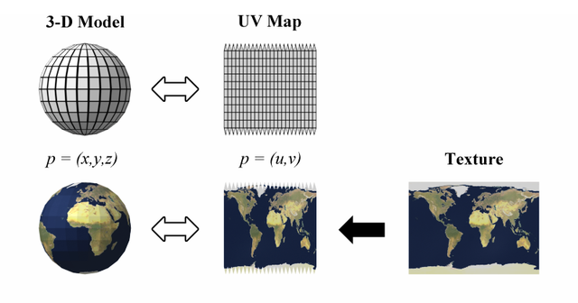

A mesh is a collection of primitives shape that make up an overarching model

## Storing Mesh Data

### Storing Mesh
To efficiently store mesh data, we want to reduce the amount of redundancy when rendering the primitive shapes. 

We do this by storing all the verticies of involved in the mesh and storing all the different combination of the verticies that make up our primitive shape

Vertice Data
[V_0, V_1, V_2, ... , V_n]

Primitive Shape Data
[ [0, 1, 2], [ 3, 4, 5], ... [n-2, n-1, n] ]

### Vertex Order Matters
In practice, the order of the verticies of a mesh is used to determine the **normal** (an indication of which side of the primitive is the front and back). Putting the verticies in the wrong order can get results that are unexpected

### Culling

Culling is a technique used to reduce the amount of primitve shapes being rendered by the render engine. It expects to render only one side of the primitve shape, the front side! (Unless specified that it's double sided). 

Determining the side of the primitve is done through vector math!

**Calculating the angle:**

Cos(ϴ) = -V * N

V = viewing vector (from the camera to the object)

N = normal vector

ϴ > 0 = front facing
ϴ <= 0 = back facing

Having the wrong normals can cause a triangle to not be rendered

### Storing Normals
Normals could be calculated per triangle using some math, but that would introduce problems when wanting to create smooth surfraces of multiple primitives.

To avoid this issue, we give every **vertex** a normal vector and interpolate normal vectors intermediate points on the primitive

Our vertex data storage now looks like this:

Vertice Data
[ [V_0, N_0], [V_1, N_1], [V_2, N_2], ... , [V_n, N_n] ]

### Storing Textures
We have an object with a correct shape, but what if we want to paint it with an image? This is done through the power of UV mapping.

UV mapping is the process of assign a pixel on the texture/image with a pixel on the model. We assign a vertex on our mesh with a 2D coordinate corresponding a pixel on the texture. Other UV positions on the non-vertex mesh pixels are interpolated.

Our vertex data storage now looks like this:

Vertice Data
[ [V_0, N_0, (U,V)_0], [V_1, N_1, (U,V)_1], [V_2, N_2, (U,V)_3], ... , [V_n, N_n, (U,V)_n] ]