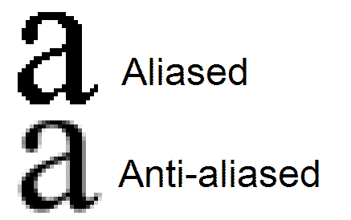
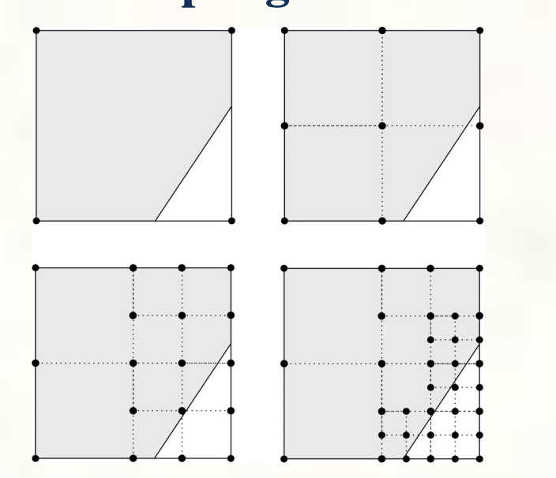
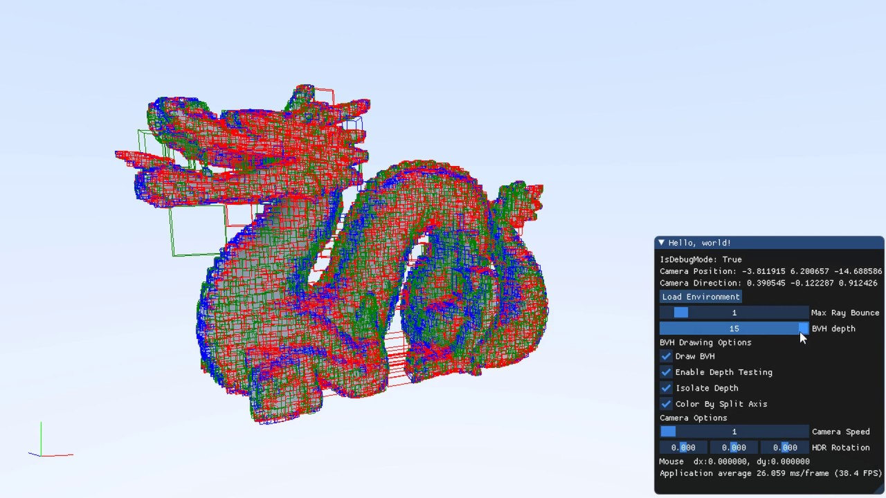
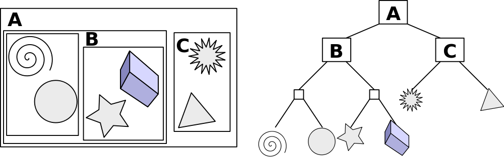
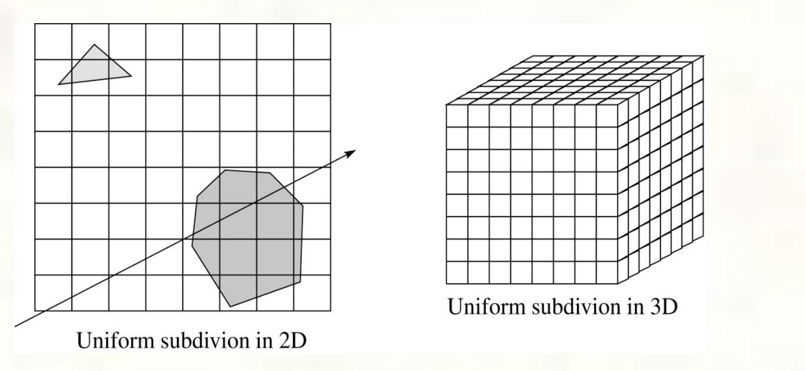
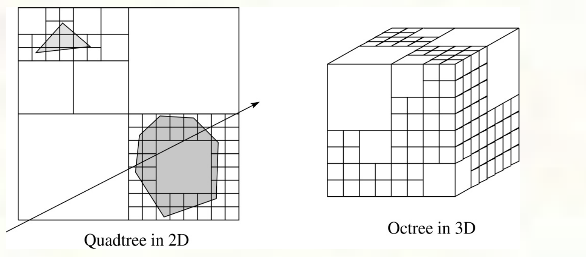

Tatics that enhanced and accelerated raytracing

# Anti-Aliasing
Aliasing is when the change between pixels is too sudden to be realistic to the image, creating a unrealistic image. In raytracing this can happen when not enough rays are sampled for a pixel.

## Super Sampling

Aliasing occurs when the sampling (i.e. shooting rays) is down too far apart, leading to certain areas of a pixel which could have a different value not being sampled

### Adaptive Sampling
The basic idea of adaptive sampling is to add more sample points (rays) in areas that show indications of inbetween values not being sampled

### Distribution Raycasting
Instead of adding more rays to get the correct sample, we can use a distribution (specifically the poisson distribution) to determine the best place on the pixel to sample our ray

# Acceleration

## Ray-Polyhedron Intersection
There are many ways to handle intersection with triangle based objects

### Bounding Volume
You can using a bounding volume to determine if you are touching an object. This allows you to use primitives to determine intersection while costing accuracy

#### Bounding Voluming Hierarchy
Instead of **only** giving the overall object a bounding volume, you can do a hierarichal tree of boudning volumes that also seperate pieces of the objects in volumes

### Spatial Subdivision

##### Uniform
The idea of spatial subdivision is to divide the world space into cells uniformally and tying objects to the cells it overlaps

##### Non-Uniform
As the name suggests, it's the same idea of the uniform method but with the cells being non-uniformally subdivided
