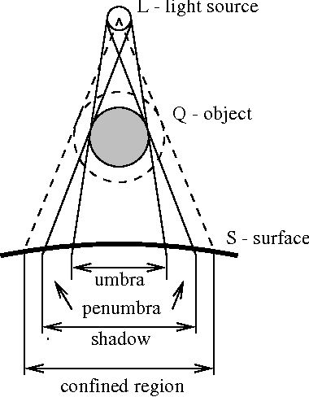

Raytracing is a form of light reflection calculation that allows shadows to be calculated and recieve more exact versions of light intensities

## Basic Raytracing
We care about the rays of light that the sun emits and bounce around before hitting our eye. The sun emits millions of rays of light that never hit our eye so if we calculated all the rays of the sun, we would be wasting many computing cycles

What is actually done in basic raytracing is to actually emit from the target (our vew/camera) and see which ray actually reaches the sun. We can set a limit on the number of reflections until we want to drop a ray and this let's us calculate only the rays we care about


### Shadows
In terms of shadows, there are two different types of shadows: hard shadow & soft shadow
- Hard Shadow: No light ever hits the particular spot
- Soft Shadow: Some light hits the spot but not all



### Raytracing PsuedoCode
```python
# Calculating all the rays
function traceRay(point, direction, scene)
	# find intersection
	(intersectPoint, normal, material) = scene.intersect(point, direction)
	
	# using the halfway point to calculate the reflection
	# (a + b)/2 = c && -(c * 2) + a = b
	reflection = -2 * (math.dot(direction, normal)) + d 

	#calculate the rotation of the current ray for the internal boucing of the object (ie: Figure out refraction ray)
	internalRay = SnellLaw(point, direction, scene) 
	
	# Get light intensity (light model: Specular + Diffuse + Ambience )
	intensity = shade(intersectPoint, normal, material, direction, scene)
	# reflection ray
	+ material.specularColor * traceRay(intersectPoint, reflection, scene)
	# refraction ray
	+ material.trasnmissive * traceRay(intersectPoint, inernalRay, scene)
	return intensity
	
# performing ray tracing on the image
function traceImage()
	for each pixel
		pixelWorld = translateFromProjectionToWorld(pixel)
		direction = (pixelWorld - camera)/ mag(pixelWorld - camera)
		traceRay(pixel world positiion, direction, scene)

# finding the intersection of a ray
function intersect(point, distance)
	x = point.x + t * direction.x
	y = point.y + t * direction.y
	z = point.z + t * direction.z
	// Example with sphere
	if object[0].radius^2 == x^2 + y^2 + z^2
		INTERSECTION CONFIRMED

function shade(intersectionPoint, normal, material, direction, scene)
	# Grab the color of the object
	intensity = material.diffuseColor

	# Go for every light hitting this object
	for each scene.lights
		# calculate the attenuation of this point (both by distance and shadow)
		attenuation = 
light.distanceAtten(intersectionPoint) * light.shadowAtten(intersectionPoint)
		# get the direcetion of the light to the point
		L = light.getDirection(intersectionPoint)
		# Do diffusion, specular, and ambient lighting
		intensity = intensity + light.ambient + attenuation*(diffuse(L, normal) + specular(L, normal))
	# Return the final light intensity
	return intensity
	
```


### Detecting Intersection
A current point on a ray can be represented using the function
$$R(t) = P_0 + t\vec{d}$$
This is a function that will produce a point for us that we can immediately use to verify for intersection. Now we need a primitive to verify against. A simple example is using a sphere!

#### Sphere

We can represent a sphere using the equation:
$$x^2+y^2+z^2=r^2$$
This equation does two things, tells us the radius if we know a point on the sphere, but it also tells us whether something is on the same sphere if we only know the radius and need to confirm the points

Using both equations, we can rewrite it into a solving for zero problem:

$$x^2+y^2+z^2-r^2=0$$
Since we can produce the x,y, and z with our ray problem, we can turn it into a problem involving only one unknown variable, t!
$$(P_0x + t\vec{d_x})^2 + (P_0y + t\vec{d_y})^2 + (P_0z + t\vec{d_z})^2 - r^2 = 0 $$
Now before we call this good, we have to note, this equation will only tell us if a point lies exactly on the sphere. We want to also be able to tell if point is inside the sphere. We call solve this by turning this into an inequality

$$(P_0x + t\vec{d_x})^2 + (P_0y + t\vec{d_y})^2 + (P_0z + t\vec{d_z})^2 - r^2 \leq 0 $$
**Disclaimer**: This assumes the sphere starts at the origin (0,0,0), you will have to take that into account when using with a sphere not at the origin:
$$(x-a)^2+(y-b)^2+(z-c)^2=r^2$$
$a$,$b$,$c$ = sphere origin position

#### Plane

Unlike spheres, we don't have a nice clean equation to verify our points, we need to do vector maths

We know that all points on a plane have the same normal, this means any vector we make using two points on the plane should be perpendicular to the normal!

We can represent our verification fuction as:

**with Q being the point generated from $R(t)$ and P being a point on the plane**

$$\vec{N} \cdot (Q - P)=0$$

0 represents the normal and the vector derived with two points being perpendicular, anything else means it does not lie on the plane. **Note:** Any point on the plane can be used to generate the $(Q-P)$ vector, as long as it's normalized.