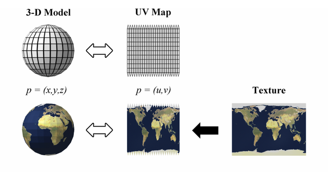
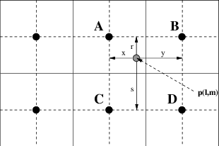
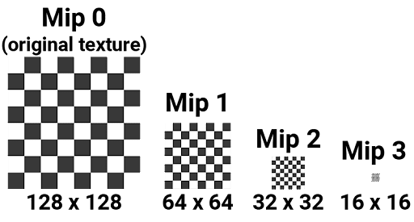
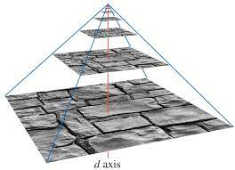
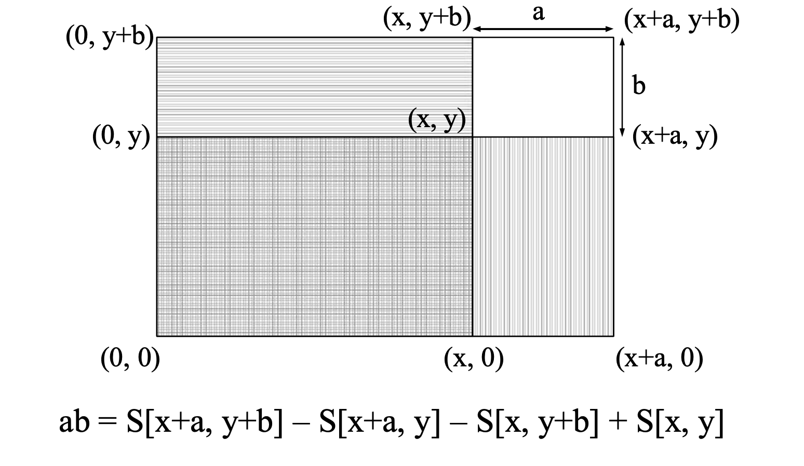
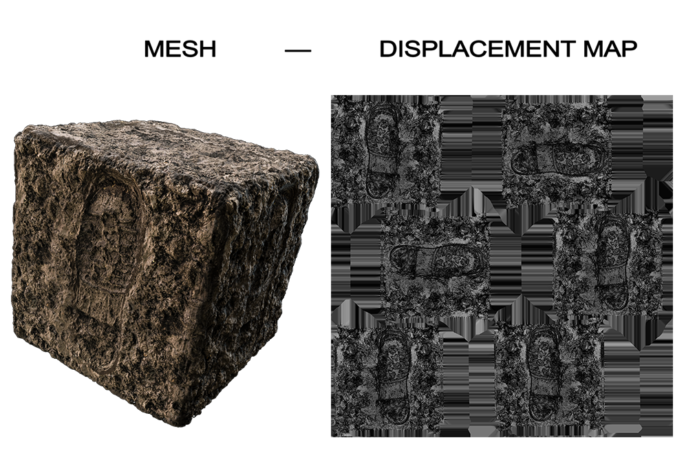
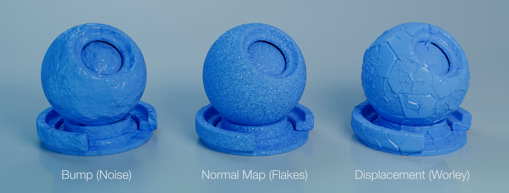
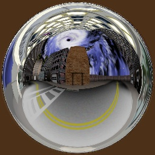
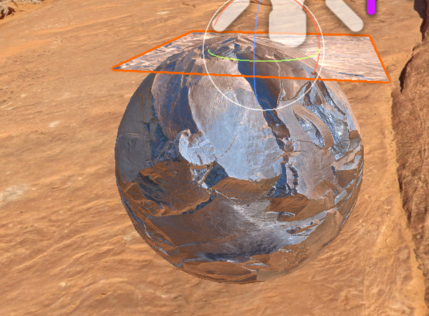

How textures (images) are skinwrapped to meshes!

## UV Mapping
Maps coordates on a texture to the mesh using (U,V) coordinates

## Texture Resampling
There are times where you need to resample a texture after doing normal UV sampling, an example is when a texture sample lands in-between pixels in the texture. Resampling is a technique of resolving this issue.

### Bilinear Resampling
This is a form of resampling where the texture pixel color is calculated using the average of four corners of the pixel

$$Pixel = A * P_D + B * P_C + C * P_B + D * P_A$$
$P_x =$ Precentage Area of pixel $x$
$A$,$B$,$C$,$D$ = Colors

### Mip Map Resampling
Using binlinear by itself can be very costly (in a perspective project) as the object to be sampled on is farther and father away, there will be more instances of texture sampling resulting inbetween pixels. 

Mip mapping is using prepocessed versions of the original texture (mip maps) for our resampling methods. As we get farther away from the image plane, the different mip maps we use for resampling. Normal interpolation is used between the two nearest mip maps. Lower quality textures are fine in this case because just like in real life we expect things to get blurry the farther they are.

### Summed area tables
Instead of using many tables (mip maps) to look up values on, we can also use the orignal image to derive the pixel

Using area math, we can find the value of the area we want to use for the pixel

## Types of Textures

Textures are used for in many ways to affect the representation of a mesh.

### Solid Textures
Textures that are indexed in a 3 demension sense. 

**Note**: Difficult to get a 3D Texture, comes with memory/performance issues with it

### Displacement Textures
Textures that can be used to represent the preturb of the surface geometry

**Note**: The affects that actual geometry and is expensive

### Bump Map Textures
Textures that are used to trick the lighting model by perturbing the normals of the surface

**Note:** This not not affect the geomtry of the object, only lies to the lighting model about the object's geometry

### Enviornment/Reflection Textures
A texture that represents an object's surroundings

