# Welcome!
Welcome to the top down shooter tutorial! The purpose of this blog is to be used to follow along during the game development club tutorial meeting but all are welcome to view this and learn from it!

# Getting Started
## Downloading Unity
If you don't already have Unity downloaded, go ahead and download the **[hub](https://unity.com/download)**


Finishing signing in and navigate to the editor installation area


This tutorial will be using version **2021.3.11f1** but what matters is that you use a version that is **2021.3.x** and is **LTS**

## Creating Project
We're going to be creating a top down shooter so we're going to want to use the 2D URP (Universal Render Pipeline). To ensures that the proper render settings are set


# Unity Introduction
In case unity is new to you, here is a quick overivew of the parts of the unity editor

## Hierarchy
This section of the editor shows you all the gameobjects in your scene and their relations to each other


## Views
There are two different cameras in use in the unity editor: the game camera & the scene camera


### Scene View
The scene view is connected to the scene camera, this is controllable by the user and allows you to see around your scene

### Game View
The game view is connected to the game camera, this is what the player *potentially* will see (potentially because there can be more than one game camera in a scene). This is represented by an object in your scene marked as a camera. You can only move it if you move the camera object. 

## Inspector
Unity is a component based engine, this means that every object stores a collection of different scripts that do different things, they are all ran doing the object's execution


## Project & Console
Project allows you to view all the assets you have available for use


The console is a window used for debugging, it allows you to print information from your code


# Player
Getting started on making this top down, let's start with the player

## Sprite
We need some way to represent the character! We're going to use the default spirtes available in unity to create the player

We're going to create an empty gameboject and call it **playe**r

We're going to creating the body and call it **body** and attach it to **player**


Let's make this a tank! We're going to attach the canon to it by creating another defaut sprite but attaching it to the **body** GameObject. We're also going to scale it to become a canon. We're also going to name this gameobject **canon**


Perfect! Now we have our tank

## Movement

Now that we have a tank, let's make it move!

Let's create our own custom code for this, navigate to the player object, click on it, and in the inspector click "add compoent"

Navigate to the bottom of the of the components options and click "new script" and call it `PlayerController`


Inside of our new script we're going to write this!

```csharp
using UnityEngine;

public class PlayerController : MonoBehaviour
{
    [SerializeField]
    private float movementSpeed = 1;
    // Start is called before the first frame update
    void Start()
    {
        
    }

    // Update is called once per frame
    void Update()
    {
        HandleMovement();
    }

    private void HandleMovement(){
        // If our horizontal buttons are pressed (a or d)
        if(Input.GetButton("Horizontal")){
            // which direction are we pressing (-1 == left and 1 == right)
            int direction = Input.GetAxis("Horizontal") < 0 ? -1 : 1;

            // Update our horizontal position 
            // (multiple by Time.deltaTime to ensure proper movement if frames come faster or later than normal)
            transform.position = new Vector3(transform.position.x + (Time.deltaTime * direction * movementSpeed), 
                                            transform.position.y, 
                                            transform.position.z);
        }

        // If our vertical buttons are pressed (w or s)
        if(Input.GetButton("Vertical")){
            // which direction are we pressing (-1 == down and 1 == up)
            int direction = Input.GetAxis("Vertical") < 0 ? -1 : 1;

            // Update our vertical position 
            // (multiple by Time.deltaTime to ensure proper movement if frames come faster or later than normal)
            transform.position = new Vector3(transform.position.x, 
                                            transform.position.y + (Time.deltaTime * direction * movementSpeed), 
                                            transform.position.z);
        }
    }
}
```

This will update our position by a certain movement speed each frame if the vertical or horizontal buttons are pressed. This uses Unity's input system (allows you to define specific inputs for actions)


## Shooting

Now that we can move, let's move on to shooting canonballs out of our canon!

To start off, let's create out canon. We're going to create the canon the same way we create the body of tank (with a circle sprite), but we're going to scale down by some degree (you can choose what you'd like)


### Prefabs

Since this is our canon balls, we're going to need to create multiple copies of these. Prefabs are a way to store your GameObjects as assets to be used and copied later. To make this canon a prefab you just need to drag the gameobject from the hierarchy to the project tab. Let's make the player a prefab too!


With that we're going to go back to our `PlayerController` and add a fire ability

```csharp
    [SerializeField]
    private float movementSpeed = 1;

    [SerializeField]
    private GameObject canonBall;

    [SerializeField]
    private Transform canonSpawnLocation;

    // Start is called before the first frame update
    void Start()
    {
        
    }

    // Update is called once per frame
    void Update()
    {
        HandleMovement();
        HandleCanonFiring();
    }

    private void HandleCanonFiring(){
        if(Input.GetButtonDown("Fire1")){
            Instantiate(canonBall, canonSpawnLocation.position, Quaternion.identity);
        }
    }
```

`Instantiate()` spawns a prefab into the scene world, in this usage at the location where we want the canonballs to spawn at. You can ignore `Quaternion.identity` it represents a rotation of 0 degrees in all axis's

Make sure to set `canonBall` to be the canonball prefab, you can set this in the inspector. And set the `canonSpawnLocation` variable/field to be a transform of where you want the canonball to spawn at(you can do this by creating an empty gameobject and place it in the place you want the canonball to be placed)


As you can tell, our canonballs aren't....moving

### Rigidbody
That's where rigidbodies come into play! Unity has its own physics system that allows you to act physics upon game objects in your scene. Rigidbody allows you to act forces onto your object (like gravity, friction, and other forces)

Go ahead an add a `rigibody2D` component to the canonball gameobject prefab


If you played the game as is you'll see that the canonballs just falls downwards to the void, this is because by default, gravity is acted on the canonball. Since we're doing a top down shooter, we don't want this to happen.

Go back to the `rigidobdy2D` component and set the gravity scale to 0, now gravity will no longer act upon our canonball. While you're at it, go to the constraints section and toggle the free z-rotation option.


### Canonball Impulse
Now that we can have forces act upon our canonballs, it's time to write the code to do that. We're going to create a new script called `CanonballAction` and attach it to the canonball gameobject prefab

```csharp
using UnityEngine;

public class CanonballAction : MonoBehaviour
{
    private Rigidbody2D rb;

    // Start is called before the first frame update
    void Start()
    {
        // GetComponent grabs a reference of a type of component living on this gameobject 
        // can be null if the type isn't living on this gameobject
        rb = GetComponent<Rigidbody2D>();    
    }

    // Send this object in direction with a magnitude of force
    public void SendBall(Vector2 direction, float force){
        if(rb ==  null){
            rb = GetComponent<Rigidbody2D>();
        }
        rb.AddForce(direction * force);
    }
}
```

We then go back to `PlayerController` and use the `SendBall` method to make the canonball to move on creation

```csharp
    [SerializeField]
    private float movementSpeed = 1;

    [SerializeField]
    [Range(200, 500)]
    private float canonForce = 1;

    [SerializeField]
    private GameObject canonBall;

    [SerializeField]
    private Transform canonSpawnLocation;

    ...

    private void HandleCanonFiring(){
        if(Input.GetButtonDown("Fire1")){
            GameObject ball = Instantiate(canonBall, canonSpawnLocation.position, Quaternion.identity);
            CanonballAction action = ball.GetComponent<CanonballAction>();
            if(action != null){
                action.SendBall(canonSpawnLocation.up, canonForce);
            }
        }
    }
```

And that we now have a shooting tank!


## Aiming 
So... we can move and shoot, but only aim in one direction what do I do if there is an enemy to my right, left, or behind me???

### Rotating the body
So if you remember our player's hierarchy, it goes Empty - > Body -> Canon. And movement happens on Empty. Since we don't want movement to be affected by rotation, we will enact rotation on the body! This way visually it will look like it's rotated in underneath, but everything is still the same. We will go to `PlayerController` and add some stuff

```csharp
    [SerializeField]
    private Transform body;

    ...

    void Update()
    {
        HandleMovement();
        HandleCanonFiring();
        HandleOrientation();
    }

    ...

    // Does math to calculate the angle to rotate the body so it is facing towards the mouse
    private void HandleOrientation(){
        Vector3 mousePos = Input.mousePosition;
        Vector3 objectPos = Camera.main.WorldToScreenPoint (body.position);
        mousePos.x = mousePos.x - objectPos.x;
        mousePos.y = mousePos.y - objectPos.y;
 
        float angle = Mathf.Atan2(mousePos.y, mousePos.x) * Mathf.Rad2Deg;
        body.rotation = Quaternion.Euler(new Vector3(0, 0, angle - 90));
    }   
```

You might have noticed the canonballs are still moving in a straight up direction, that's because of our hierarchy!


If you take a look, the CanonSpawnLocation object (which is used for both deciding where to spawn the canonballs and what the **direction** of their movement is) is not under the body. This means that when the body rotates, the spawner does not! Let's fixing that by moving the spawner to be under the body


Viola! A working moving, shooting, and rotating tank!

# Enemy
Now that we have a working tank, it's time to make a target to shoot at! ENEMIES

Let's start witha dummy enemy, just to shoot at

## Dummy

### Sprite
Again we need a visual representation of the enemy, let's use the `hexagon flat top` default sprite from Unity! Also let's do the same hierarchy we did with the player (Empty -> Body)

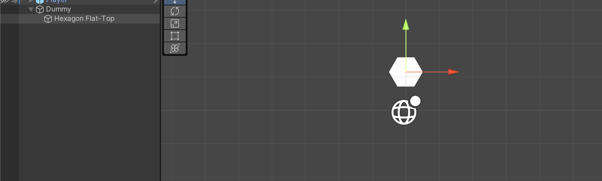

Let's go ahead and make this a prefab for future use

### Collision

So if you move the player towards the enemy or shoot at it, you'll notice that everything goes through it. That's because there is no notion of collision for this enemy. We can fix that by adding a collider!

Go ahead an add a `CircleCollider2D` this is a circular collider for our enemy (close enough to the hexagon shape, does not need to be exact)

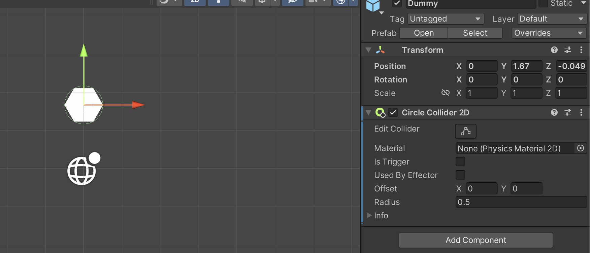

This is not enough, colliders only work against other colliders, so we need to add colliders to our canonballs and player

Go ahead an add a `CircleCollider2D` to the canonball prefab and a `BoxCollider2D` to our player

Now if we launch the game, we'll see that everything collides now!


### Enemy Status/Logic
So now we have a visual representation of the enemy, we need to give it some substance (health, damage, death)

We're going to create a script for any enemy to use, but we're going to do it in a different way. In the project tab right click and do `Create -> C# Script` and let's call it `EnemyBase` this will hold logic that all enemies need

```csharp
using UnityEngine;

public class EnemyBase : MonoBehaviour
{
    [SerializeField]
    private float maxHealth = 5;

    private float curHealth;

    // Start is called before the first frame update
    void Start()
    {
        curHealth = maxHealth;
    }

    // This runs whenever an object with a collider touches this object
    public void OnCollisionEnter2D(Collision2D other){
        if(other.collider.tag == "canon"){
            if(curHealth <= 1){
                Destroy(this.gameObject);
            }else{
                curHealth--;
            }
        }
    }

}
```

If you check in the code, we compare against a `tag`, this is a piece of metadata you can attach to objects, we're going to give this metadata to our canons.

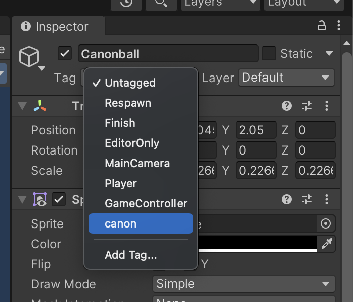

To test this, let's attach it to our dummy enemy


Awesome! We have an enemy that albiet can't move or attack you, can take damage and die!

Side note: We can do the same logic we used for destroying the enemy for the canonballs. In `CanonballAction`, we can add:

```csharp

    public void OnCollisionEnter2D(Collision2D other){
        Destroy(this.gameObject);
    }
```


## Follow Enenmy

Now with this base enenmy logic, let's make an enemy that follows the player

### Follow Logic
Let's make a new script called `FollowEnemy`. It will inherit the logic from `EnemyBase` (health, damage, death), but we will insert new logic for following the player

```csharp
using UnityEngine;

public class FollowEnemy : EnemyBase
{
    [SerializeField]
    private Transform target;

    [SerializeField]
    private float movementSpeed;

    // Update is called once per frame
    void Update()
    {
        Vector2 direction = target.position - transform.position;
        float angle = Mathf.Atan2(direction.y, direction.x) * Mathf.Rad2Deg;
        this.transform.rotation = Quaternion.Euler(0, 0, angle - 90);

        this.transform.position = transform.up * movementSpeed * Time.deltaTime + transform.position;
    }
}
```

This tells the enemy to look at the target and move towards it


### Damaging Player
Now that our enemy can follow the player, we need to let it damage the player. Let's go back to `PlayerController`

```csharp
    public float maxHealth = 5;
    private float curHealth; 

    public float invisTime = 2;
    private bool invis = false;

    ...

    public void OnTriggerStay2D(Collider2D other){
        if(other.tag == "Enemy" && !invis){
            if(curHealth <= 1){
                Debug.Log("Dead!");
            }else{
                StartCoroutine(takeDamage());
            }
        }
    }

    public IEnumerator takeDamage(){
        invis = true;
        curHealth--;
        yield return new WaitForSeconds(invisTime);
        invis = false;
    }
```

This uses a part of the colider system! **Trigger**! Imagine you want to detect collision without enacting the actual collision, that's what triggers are!

Make sure to create an `Enemy` tag for the Enemy GameObject and have these settings on the player object

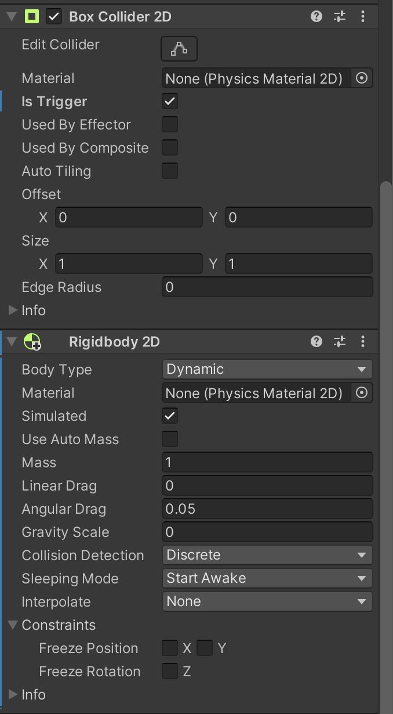

# Game Manager / Singletons

Now that we have a working player and a working enemy we need a way to share critical information between entities in the game and perform critical game events

We call these objects `Managers` or `Singletons`, they are unique objects that have no copy existing in a scene that is accessible from all scripts

## General Game Manager

Some things we want to do is:
1. Reset the level/game
2. Spawn the player at a particular position
3. Distribute the player's position so all enemies can find it
4. Whatever else we think we want to handle :3

Let's start with creating our GameManager object(empty gameobject) along with a `GameManager` script:

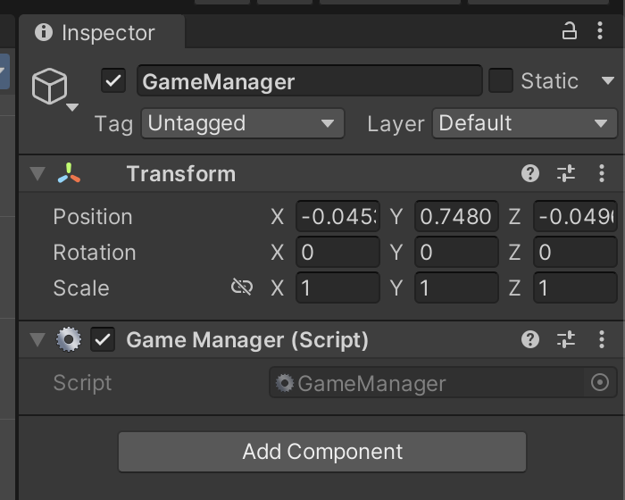

```csharp
using UnityEngine;
using UnityEngine.SceneManagement;

public class GameManager : MonoBehaviour
{
    private static GameManager _instance;
    public static GameManager instance{
        get{
            return _instance;
        }
    }

    [SerializeField]
    private Transform playerSpawnLocation;

    [SerializeField]
    private GameObject playerObject;
    private Transform playerPosition;
    private GameObject curPlayer;

    public void Awake(){
        if(_instance == null){
            _instance = this;
            DontDestroyOnLoad(this.gameObject);
        }else{
            Destroy(this.gameObject);
        }
    }

    // Start is called before the first frame update
    void Start()
    {
        spawnPlayer();
    }

    public Transform getPlayerPosition(){
        return playerPosition;
    }

    public void spawnPlayer(){
        curPlayer = Instantiate(playerObject, playerSpawnLocation.position, Quaternion.identity);
        playerPosition = curPlayer.transform;
    }

    public void reset(){
        Destroy(curPlayer);
        spawnPlayer();
    }
}
```
`DontDestroyOnLoad` is a special method that marks a gameobject to never to be deleted when changing unity scenes (ex: changing levels)

A static variable belongs to the class and can be accessed from anywhere, hence why we have the variable `instance`. This way, anyone can touch this manager and call its methods

To keep in mind for future reference, the logic inside the `Awake()` method is general what is done when creating singletons
## Updating Existing Functions

### Follow Enemy
If you remember, our enemy uses the transform of our player to figure out how to move towards it. Sadly this won't work at scale since we had to manually assign the transform variable in the inspector.

Now that we have `GameManager` which can return to us the player's position, now is a great time to update that code.

Let's make some changes to `EnemyBase` and `FollowEnemy`:

```csharp
    // EnemyBase.cs
    public virtual void Start()
    {
        curHealth = maxHealth;
    }
```

```csharp
    // FollowEnemy.cs
    private Transform target;
    ...

    public override void Start(){
        target =  GameManager.instance.getPlayerPosition();
        base.Start();
    }

    // Update is called once per frame
    void Update()
    {
        if(target == null){
            target = GameManager.instance.getPlayerPosition();
        }else{
            Vector2 direction = target.position - transform.position;
            float angle = Mathf.Atan2(direction.y, direction.x) * Mathf.Rad2Deg;
            this.transform.rotation = Quaternion.Euler(0, 0, angle - 90);

            this.transform.position = transform.up * movementSpeed * Time.deltaTime + transform.position;
        }
        
    }
```

### Player Death
Currently, if you player dies, only a print statement in the console is done. Let's reset the game if the player dies

Going back to `PlayerController`:
```csharp
    public void OnTriggerStay2D(Collider2D other){
        if(other.tag == "Enemy" && !invis){
            if(curHealth <= 1){
                GameManager.instance.reset();
            }else{
                StartCoroutine(takeDamage());
            }
        }
    }
```

We'll destroy this version of the player and let the game manger handle recreating it, along with it's details

Now if we put multiple enemies into the scene:


Everything is looking good, very promising! Of course, the game manager can be extended further in the future, but for now let's move on

# Camera
The game camera is what allows you to view what is happening in your scene. Since objects move around in a since, they will eventually move outside of the scope of the camera. But we always have things we want to never leave the frame of the camera: THE PLAYER

Currently the camera is stantionary, does not move at allllll. Let's make the camera follow the the player now!

In our scene, we always have an object that is chosen to be the camera. In this case it is called `Main Camera`

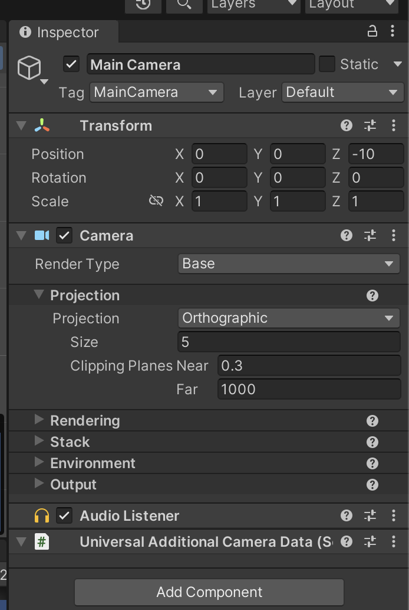

Let's add a new script to this object called `CameraFollow`

```csharp
using UnityEngine;

public class CameraFollow : MonoBehaviour
{
    [SerializeField]
    [Range(0.005f, 0.05f)]
    private float followSpeed;

    private Transform target;

    // Start is called before the first frame update
    void Start()
    {
        target = GameManager.instance.getPlayerPosition();
    }

    // LateUpdate gets called after Update and FixedUpdate
    void LateUpdate()
    {
        if(target == null){
            target = GameManager.instance.getPlayerPosition();
        }else{
            Vector2 newPos = Vector2.Lerp(transform.position, target.position, followSpeed);
            transform.position = new Vector3(newPos.x, newPos.y, transform.position.z);
        }
    }
}
```

This script does a simple action of moving the position towards the player's position at a given speed.

 Again, with our game manager already made, grabbing the player's position is very easy


# UI 
At this point, we've created almost all the pieces needed before we can start making levels 

We have a notion of health under the hood but we can't tell that it exists on the screen. It's time to add a UI

To add a canvas, go to the hierarchy, right click and create a canvas, name it `UI`

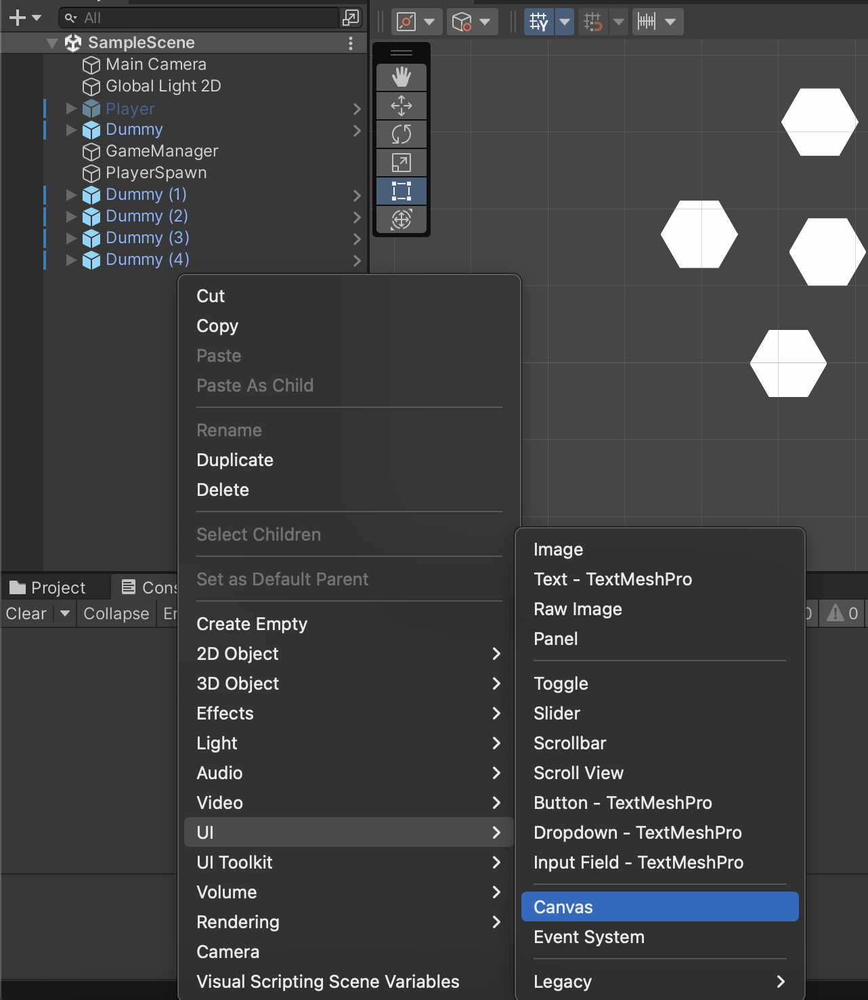

On the UI, set the canvas scaler to scale with the screen size (WE DON'T WANT A FIXED SIZED CANVAS)

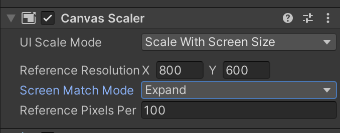

Let's make this a prefab so we can spawn it in through the `GameManager`

For easier editing, I recommend opening up the UI prefab so all you have to see is the UI area

## Health Bar

### Sprite
We need a sprite to use for the health bar. Guess what? We're gonna use default sprites AGAIN!

Go ahead and go to the projet tab and create a sprite rectangle

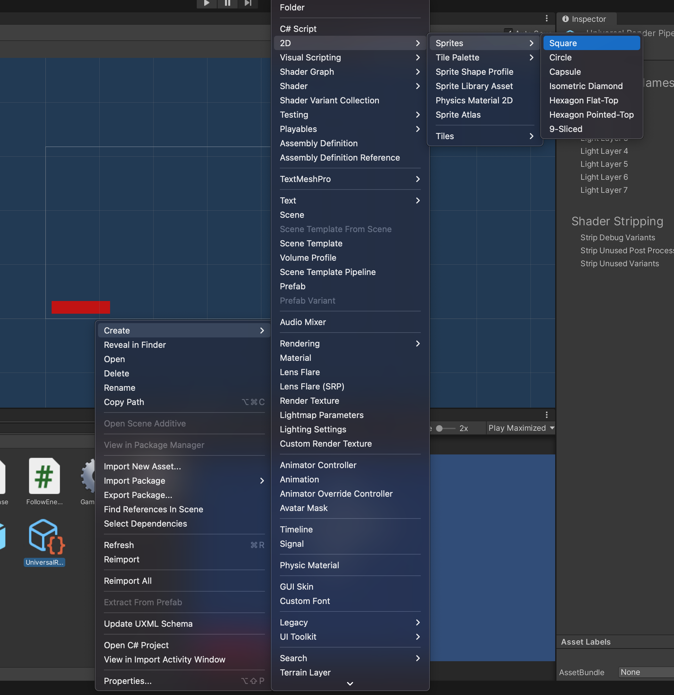

Make sure to name it `healthbar` or something similar so we can find it later

Go ahead and create a UI image under the UI gameobject

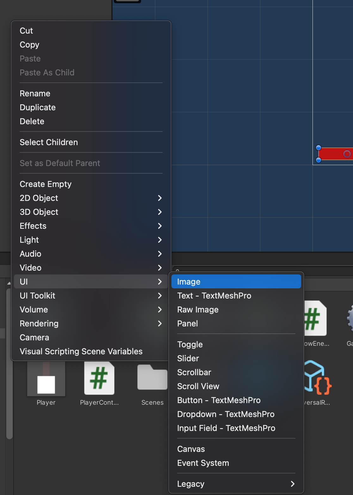

call it `HealthBarBg`, we're going to use it as the background for our health bar

In the Inspector, set the image to be the healthbar sprite we created in the project tab (it might be a different name, but it's a rectangle sprite)

Go ahead and make it black too

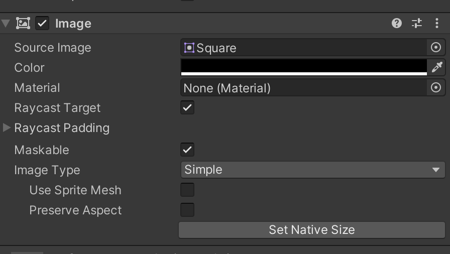

Next, duplicate this object and make it a child of `HealthBarBg` call it just `HealthBar`. Set it to these settings:

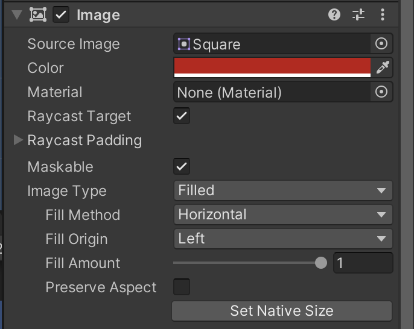

### UI Logic

Since there is only every going to be one existing UI, let's make it a `Singleton/Manager`! That way anything that needs to touch the UI can reach it

On the top UI gameobject, creating a script called `UIManager`. Using the similar logic to the `GameManager`

```csharp
using UnityEngine;
using UnityEngine.UI;

public class UIManager : MonoBehaviour
{
    private static UIManager _instance;
    public static UIManager instance{
        get{
            return _instance;
        }
    }

    [SerializeField]
    private Image healthBar;

    public void Awake(){
        if(_instance == null){
            _instance = this;
            DontDestroyOnLoad(this.gameObject);
        }else{
            Destroy(this.gameObject);
        }
    }

    public void setHealth(float precentage){
        healthBar.fillAmount = precentage;
    }
}
```

Inside `GameManager` we're going to make some additional changes:
```csharp
    [SerializeField]
    private GameObject uiObject;
    ...

    void Start()
    {
        spawnUI();
        spawnPlayer();
    }

    ...

    public void spawnUI(){
        Instantiate(uiObject, Vector3.zero, Quaternion.identity);
    }
```

In the inspector you can attach the health bar image as `UIManager`'s `healthbar` variable. You can also set the UI prefab to be the `uiObject` variable in `GameManager`

Let's start using this healthbar!!! In `PlayerController`, we'll make a tiny change:

```csharp
    void Start()
    {
        curHealth = maxHealth;
        UIManager.instance.setHealth(1);
    }

    ...

    public IEnumerator takeDamage(){
        invis = true;
        curHealth--;
        UIManager.instance.setHealth(curHealth/maxHealth);
        yield return new WaitForSeconds(invisTime);
        invis = false;
    }
```

Now we have a working health bar!!!


# Level Making

With that, we have enough to make our level!!!

## Boxing out level

Let's clear out our scene to only have the camera, Global Light, GameManager, and Player Spawn position in it

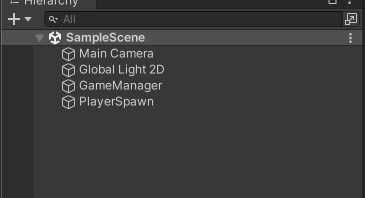

Let's make this game a horror house, where you need to reach the end of the map without dying to win the game. 

We're going to just block out the level using the default sprites of unity

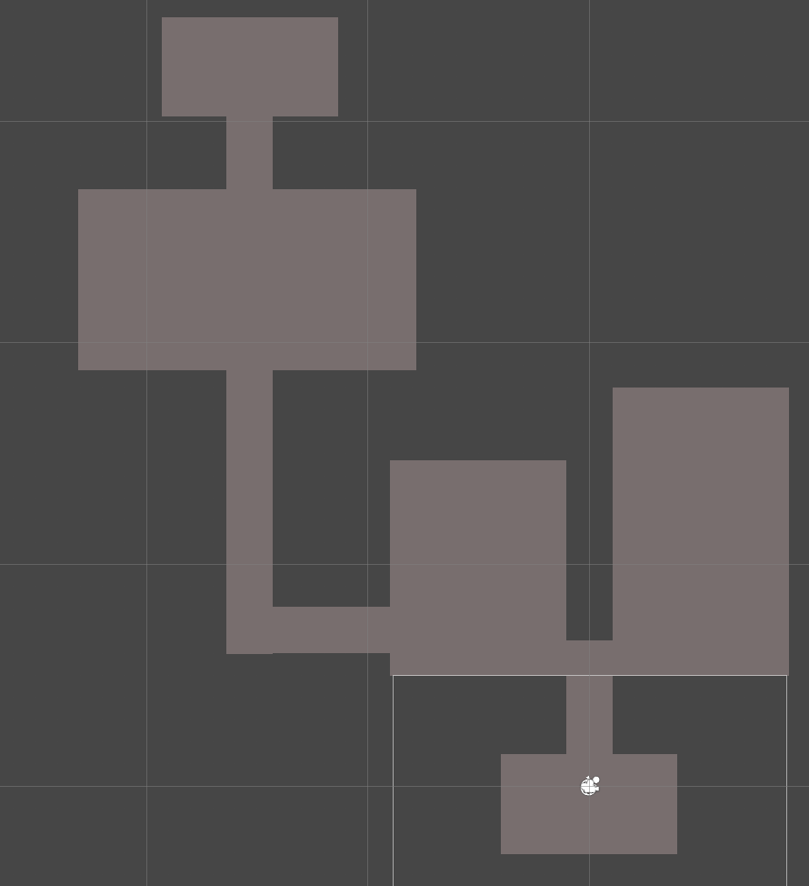

This will be the layout of our level! If you run it now though, the player can easily move outside of the boudaries, so let's make boundaries!

It's a pretty simple process, give all the blocks of the level colliders with the "Used by Composite" option toggled

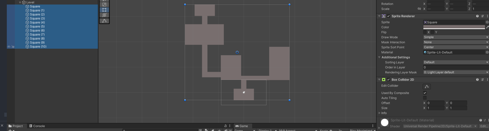

Then give them a parent and attach the `Composite Collider 2D` component, this puts all the coliders together to be come one giant collider

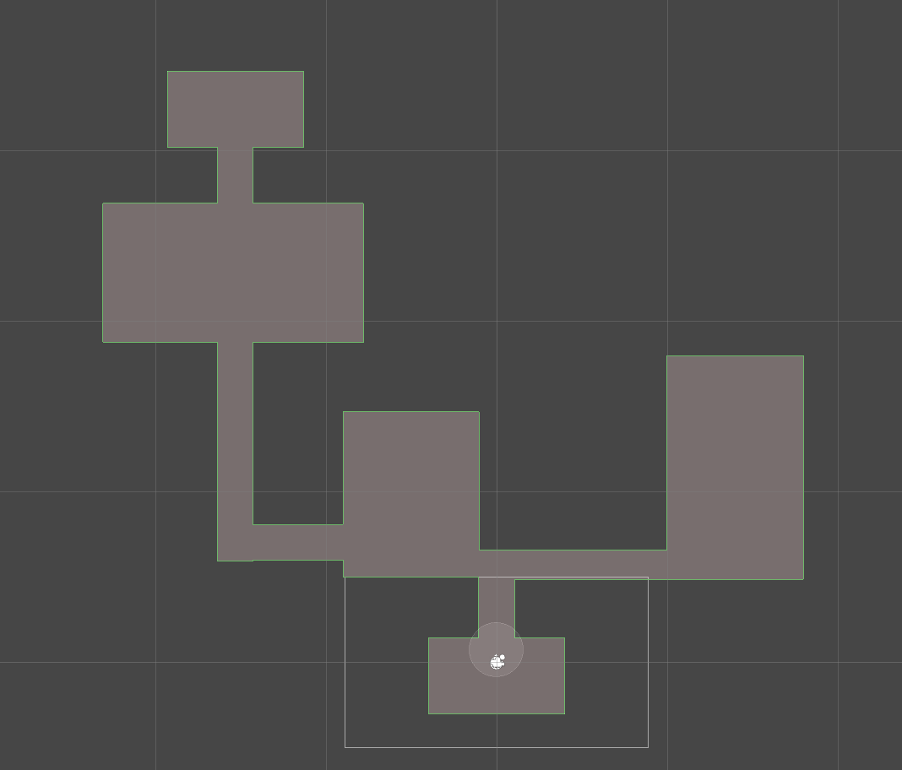

Now we need to change some things to the player:

1. Change its box collider to not be a trigger
2. Change this set up code in `PlayerController`

```csharp
    public void OnTriggerStay2D(Collider2D other){
        if(other.tag == "Enemy" && !invis){
            if(curHealth <= 1){
                GameManager.instance.reset();
            }else{
                StartCoroutine(takeDamage());
            }
        }
    }
```
to 
```csharp
    public void OnCollisionStay2D(Collision2D other){
        if(other.collider.tag == "Enemy" && !invis){
            if(curHealth <= 1){
                GameManager.instance.reset();
            }else{
                StartCoroutine(takeDamage());
            }
        }
    }
```

And now~ We have our boundary!!!


## Loop

Let's add the finish line so when you making it to the end, it restarts to level

We're just going to make an yellow capsule sprite with a 2D capsulef collider set to is Trigger

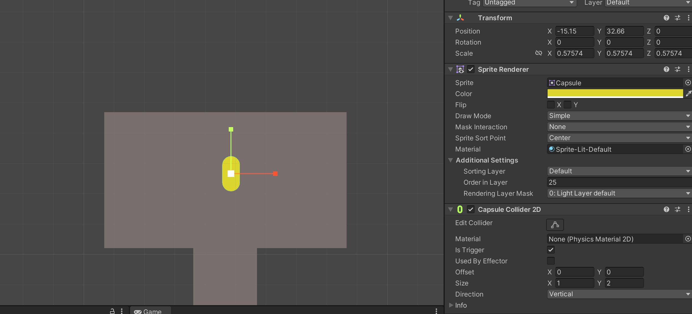

We're going to attach a new script to it called `Goal` and it will be a simple function

```csharp
using UnityEngine;

public class Goal : MonoBehaviour
{
    public void OnTriggerEnter2D(Collider2D other){
        if(other.tag == "Player"){
            GameManager.instance.reset();
        }
    }
}
```

If the player reaches this, reset the game! Reminder to give the player object to "Player" tag

## Obstacles
Now that we have a start and finish let's add some obstacles!

We can just keep using the box sprite as a different color to be obstacles. 

Remember to have the "Used by Compisite" option off for these obstacles

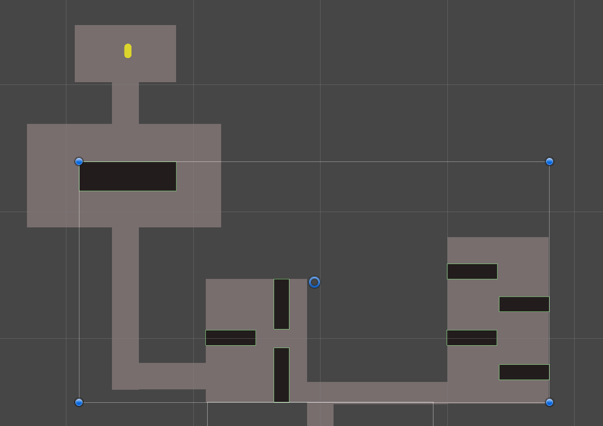

## Enemy Spawners
Finally makes spawners for our enemies, so the player has something to worry about

We're going to create empty gameobjects and give them trigger colliders (up to you what time), it will let us know if a player is in range to activate enemy spawning

We're going to attach a script called `EnemySpawner` and inside it will hold:

```csharp
using UnityEngine;
using System.Collections;

public class EnemySpawner : MonoBehaviour
{
    [SerializeField]
    private GameObject enemy;

    [SerializeField]
    private float enemyBurst;

    [SerializeField]
    private float cooldownTime;

    private bool available = true;

    public void OnTriggerEnter2D(Collider2D other){
        if(other.tag == "Player" && available){
            StartCoroutine(spawnEnemy());
        }
    }

    private IEnumerator spawnEnemy(){
        available = false;

        for(int i = 0; i < enemyBurst; i++){
            yield return new WaitForSeconds(0.5f);
            Instantiate(enemy, transform.position, Quaternion.identity);
        }

        yield return new WaitForSeconds(cooldownTime);

        available = true;
        
    }
}
```

This will spawn our enemies if the player enters our trigger

Now everything should be working properly except...


This is because the enemies don't have a rigidbody attached to them to enforce our boundaries for us! Let's go ahead and attach that

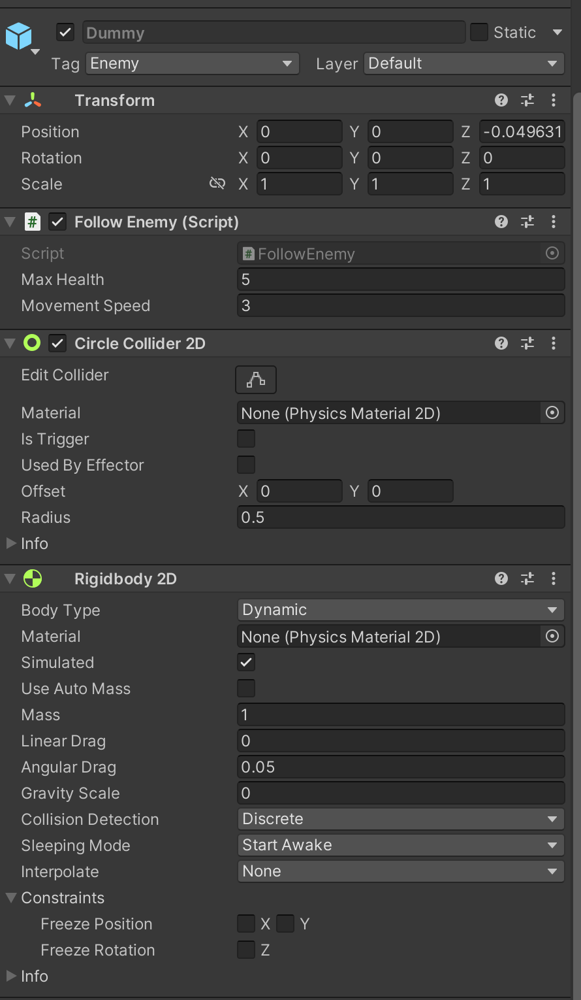

Now we have a working spawner!


Everythings working! Now for one final touch. Currently the background is blue due to the camera being set that way. 

Let's make it fit the theme of the room! Go to the main camera and look at the enviornment tab. There you should see a background color to set, go ahead and set it to black

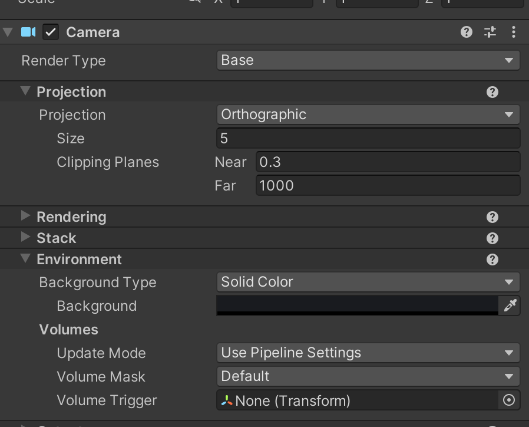

Now we have a working game! 


To summarize some of the main things we've created:
- Working Character movement system
- Canon shooting ability
- GameManager System
- UI Manager System
- Collision
- Game Loop
- Enemies

Hope you've learned many things in this tutorial!!!

