# Welcome!
Welcome to the top down shooter tutorial! The purpose of this blog is to be used to follow along during the game development club tutorial meeting but all are welcome to view this and learn from it!

# Getting Started
## Downloading Unity
If you don't already have Unity downloaded, go ahead and download the **[hub](https://unity.com/download)**


Finishing signing in and navigate to the editor installation area

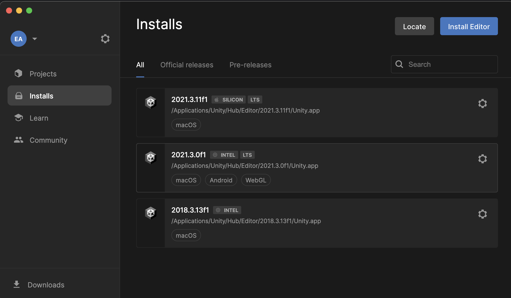

This tutorial will be using version **2021.3.11f1** but what matters is that you use a version that is **2021.3.x** and is **LTS**

## Creating Project
We're going to be creating a top down shooter so we're going to want to use the 2D URP (Universal Render Pipeline). To ensures that the proper render settings are set

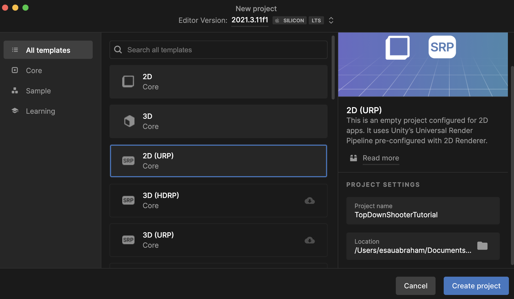

# Unity Introduction
In case unity is new to you, here is a quick overivew of the parts of the unity editor

## Hierarchy
This section of the editor shows you all the gameobjects in your scene and their relations to each other

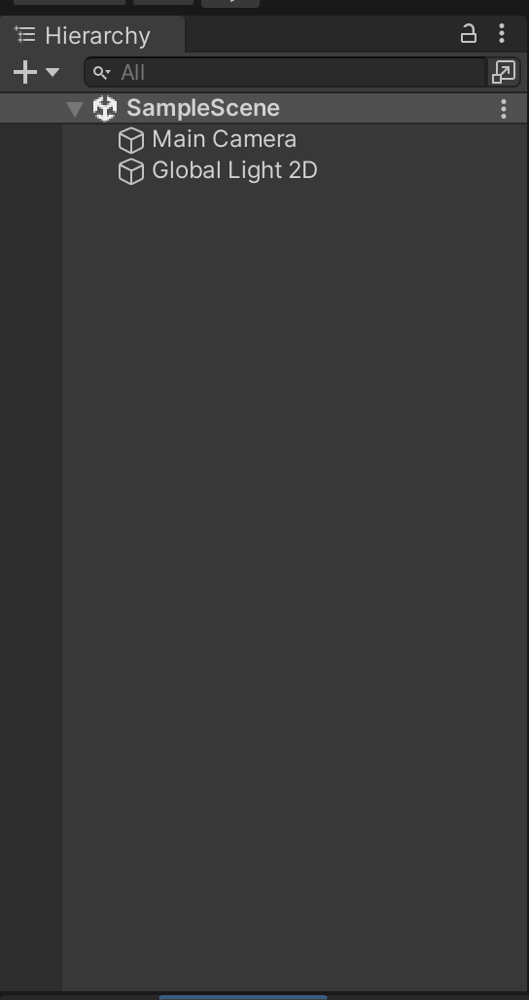

## Views
There are two different cameras in use in the unity editor: the game camera & the scene camera

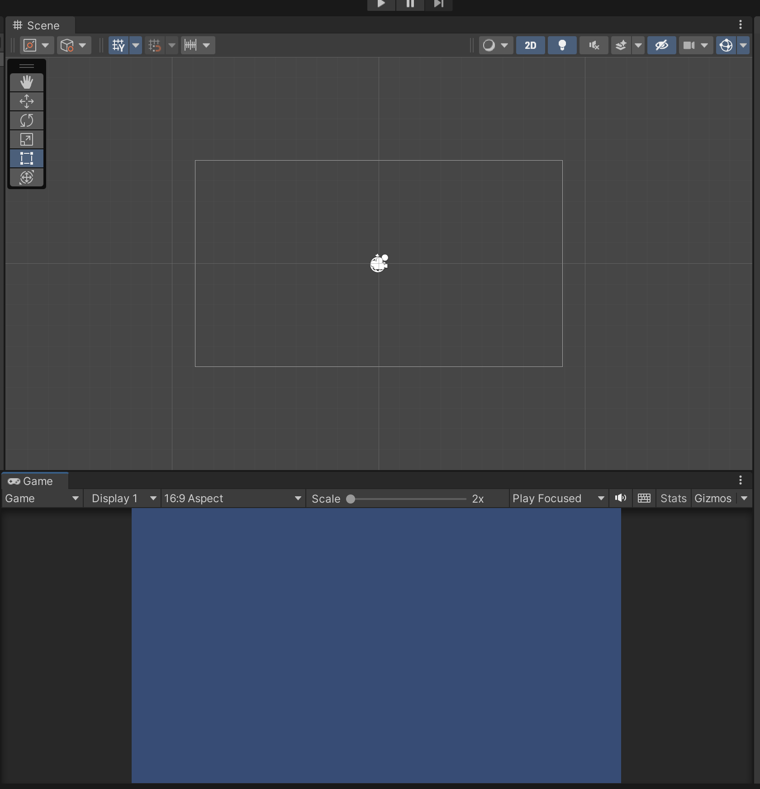

### Scene View
The scene view is connected to the scene camera, this is controllable by the user and allows you to see around your scene

### Game View
The game view is connected to the game camera, this is what the player *potentially* will see (potentially because there can be more than one game camera in a scene). This is represented by an object in your scene marked as a camera. You can only move it if you move the camera object. 

## Inspector
Unity is a component based engine, this means that every object stores a collection of different scripts that do different things, they are all ran doing the object's execution

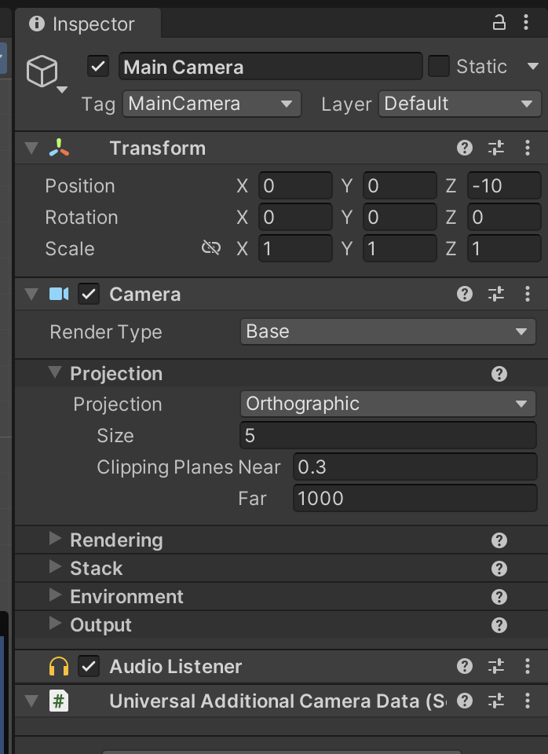

## Project & Console
Project allows you to view all the assets you have available for use

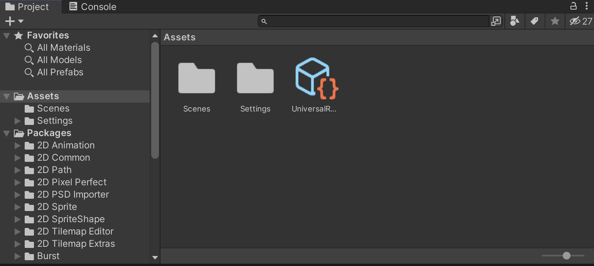

The console is a window used for debugging, it allows you to print information from your code

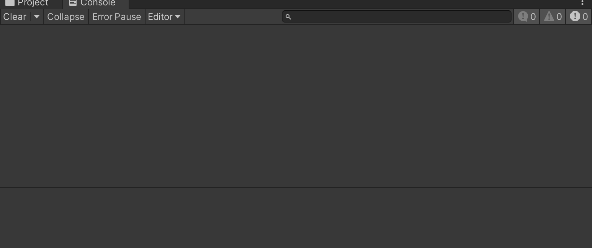

# Player
Getting started on making this top down, let's start with the player

## Sprite
We need some way to represent the character! We're going to use the default spirtes available in unity to create the player

We're going to create an empty gameboject and call it **playe**r

We're going to creating the body and call it **body** and attach it to **player**
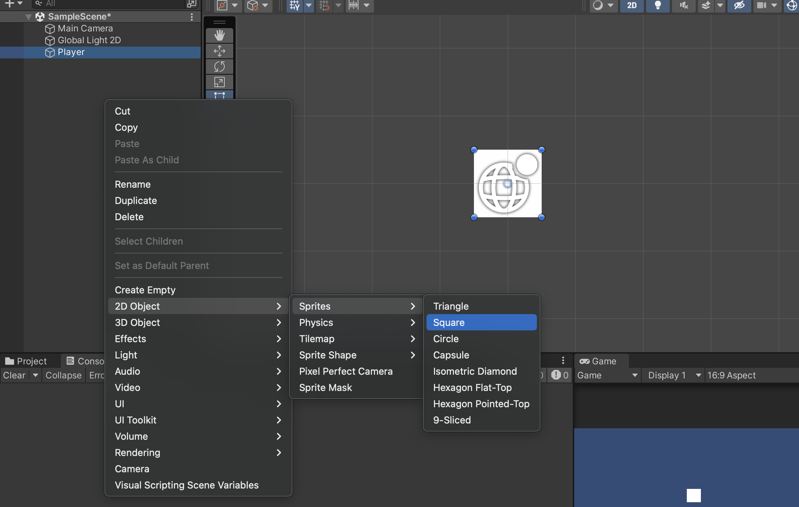

Let's make this a tank! We're going to attach the canon to it by creating another defaut sprite but attaching it to the **body** GameObject. We're also going to scale it to become a canon. We're also going to name this gameobject **canon**

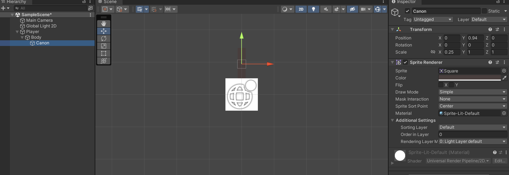

Perfect! Now we have our tank

## Movement

Now that we have a tank, let's make it move!

Let's create our own custom code for this, navigate to the player object, click on it, and in the inspector click "add compoent"

Navigate to the bottom of the of the components options and click "new script" and call it `PlayerController`


Inside of our new script we're going to write this!

```csharp
using UnityEngine;

public class PlayerController : MonoBehaviour
{
    [SerializeField]
    private float movementSpeed = 1;
    // Start is called before the first frame update
    void Start()
    {
        
    }

    // Update is called once per frame
    void Update()
    {
        HandleMovement();
    }

    private void HandleMovement(){
        // If our horizontal buttons are pressed (a or d)
        if(Input.GetButton("Horizontal")){
            // which direction are we pressing (-1 == left and 1 == right)
            int direction = Input.GetAxis("Horizontal") < 0 ? -1 : 1;

            // Update our horizontal position 
            // (multiple by Time.deltaTime to ensure proper movement if frames come faster or later than normal)
            transform.position = new Vector3(transform.position.x + (Time.deltaTime * direction * movementSpeed), 
                                            transform.position.y, 
                                            transform.position.z);
        }

        // If our vertical buttons are pressed (w or s)
        if(Input.GetButton("Vertical")){
            // which direction are we pressing (-1 == down and 1 == up)
            int direction = Input.GetAxis("Vertical") < 0 ? -1 : 1;

            // Update our vertical position 
            // (multiple by Time.deltaTime to ensure proper movement if frames come faster or later than normal)
            transform.position = new Vector3(transform.position.x, 
                                            transform.position.y + (Time.deltaTime * direction * movementSpeed), 
                                            transform.position.z);
        }
    }
}
```

This will update our position by a certain movement speed each frame if the vertical or horizontal buttons are pressed. This uses Unity's input system (allows you to define specific inputs for actions)


## Shooting

Now that we can move, let's move on to shooting canonballs out of our canon!

To start off, let's create out canon. We're going to create the canon the same way we create the body of tank (with a circle sprite), but we're going to scale down by some degree (you can choose what you'd like)

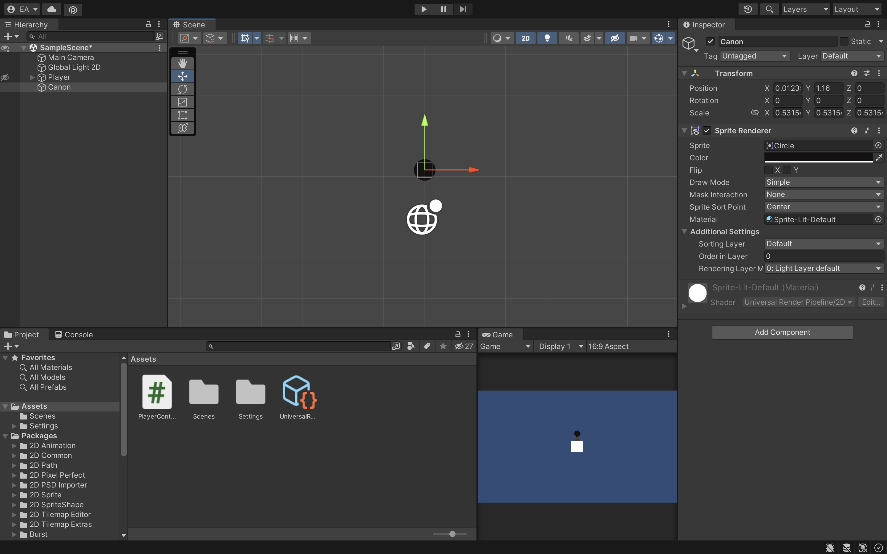

### Prefabs

Since this is our canon balls, we're going to need to create multiple copies of these. Prefabs are a way to store your GameObjects as assets to be used and copied later. To make this canon a prefab you just need to drag the gameobject from the hierarchy to the project tab. Let's make the player a prefab too!

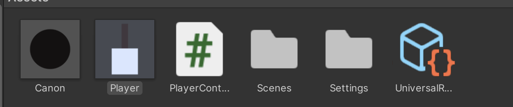

With that we're going to go back to our `PlayerController` and add a fire ability

```csharp
    [SerializeField]
    private float movementSpeed = 1;

    [SerializeField]
    private GameObject canonBall;

    [SerializeField]
    private Transform canonSpawnLocation;

    // Start is called before the first frame update
    void Start()
    {
        
    }

    // Update is called once per frame
    void Update()
    {
        HandleMovement();
        HandleCanonFiring();
    }

    private void HandleCanonFiring(){
        if(Input.GetButtonDown("Fire1")){
            Instantiate(canonBall, canonSpawnLocation.position, Quaternion.identity);
        }
    }
```

`Instantiate()` spawns a prefab into the scene world, in this usage at the location where we want the canonballs to spawn at. You can ignore `Quaternion.identity` it represents a rotation of 0 degrees in all axis's

Make sure to set `canonBall` to be the canonball prefab, you can set this in the inspector. And set the `canonSpawnLocation` variable/field to be a transform of where you want the canonball to spawn at(you can do this by creating an empty gameobject and place it in the place you want the canonball to be placed)

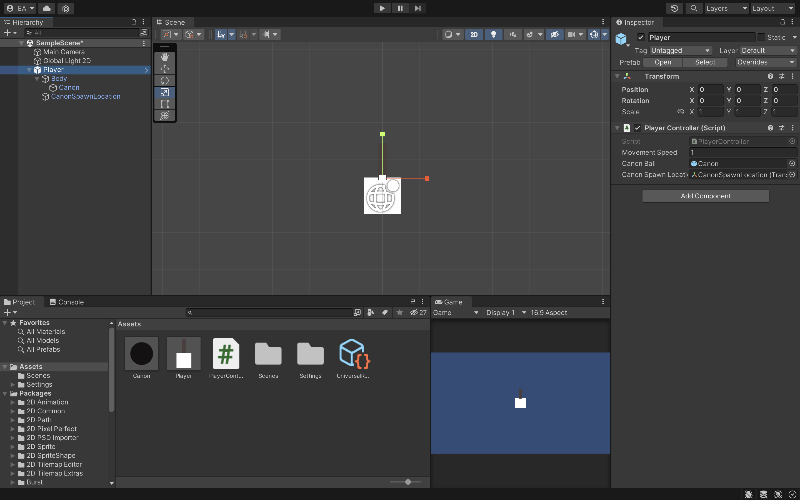
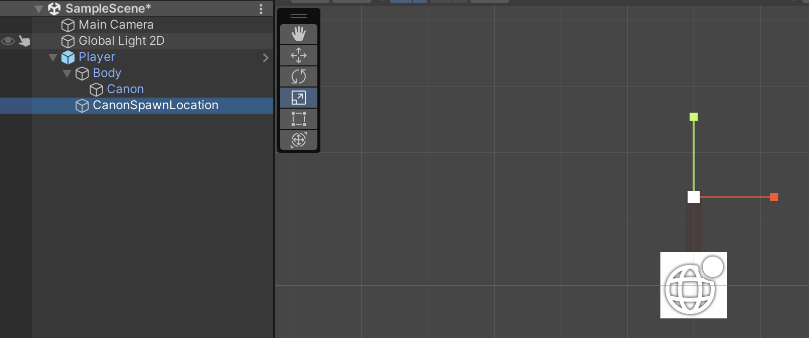


As you can tell, our canonballs aren't....moving

### Rigidbody
That's where rigidbodies come into play! Unity has its own physics system that allows you to act physics upon game objects in your scene. Rigidbody allows you to act forces onto your object (like gravity, friction, and other forces)

Go ahead an add a `rigibody2D` component to the canonball gameobject prefab

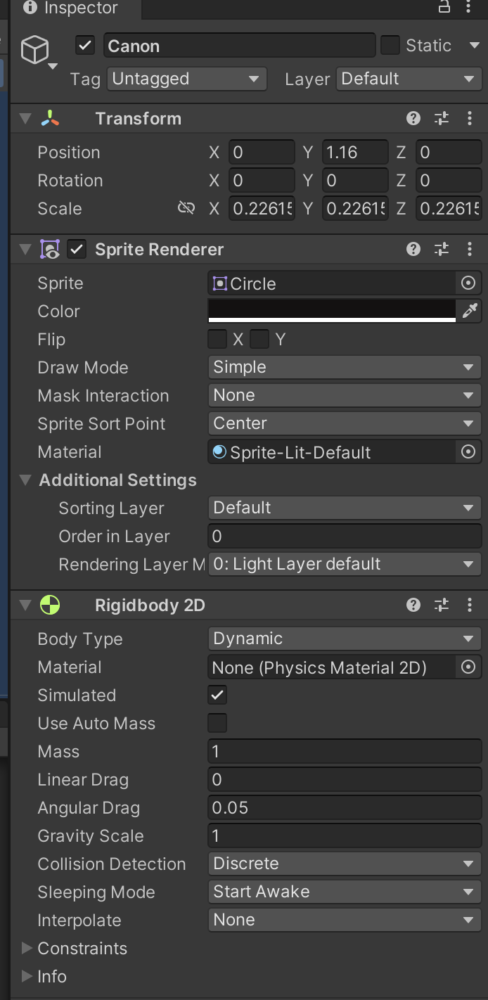

If you played the game as is you'll see that the canonballs just falls downwards to the void, this is because by default, gravity is acted on the canonball. Since we're doing a top down shooter, we don't want this to happen.

Go back to the `rigidobdy2D` component and set the gravity scale to 0, now gravity will no longer act upon our canonball. While you're at it, go to the constraints section and toggle the free z-rotation option.

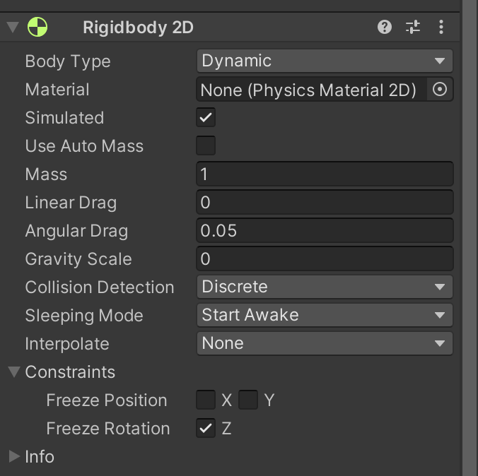

### Canonball Impulse
Now that we can have forces act upon our canonballs, it's time to write the code to do that. We're going to create a new script called `CanonballAction` and attach it to the canonball gameobject prefab

```csharp
using UnityEngine;

public class CanonballAction : MonoBehaviour
{
    private Rigidbody2D rb;

    // Start is called before the first frame update
    void Start()
    {
        // GetComponent grabs a reference of a type of component living on this gameobject 
        // can be null if the type isn't living on this gameobject
        rb = GetComponent<Rigidbody2D>();    
    }

    // Send this object in direction with a magnitude of force
    public void SendBall(Vector2 direction, float force){
        if(rb ==  null){
            rb = GetComponent<Rigidbody2D>();
        }
        rb.AddForce(direction * force);
    }
}
```

We then go back to `PlayerController` and use the `SendBall` method to make the canonball to move on creation

```csharp
    [SerializeField]
    private float movementSpeed = 1;

    [SerializeField]
    [Range(200, 500)]
    private float canonForce = 1;

    [SerializeField]
    private GameObject canonBall;

    [SerializeField]
    private Transform canonSpawnLocation;

    ...

    private void HandleCanonFiring(){
        if(Input.GetButtonDown("Fire1")){
            GameObject ball = Instantiate(canonBall, canonSpawnLocation.position, Quaternion.identity);
            CanonballAction action = ball.GetComponent<CanonballAction>();
            if(action != null){
                action.SendBall(canonSpawnLocation.up, canonForce);
            }
        }
    }
```

And that we now have a shooting tank!


## Aiming 
So... we can move and shoot, but only aim in one direction what do I do if there is an enemy to my right, left, or behind me???

### Rotating the body
So if you remember our player's hierarchy, it goes Empty - > Body -> Canon. And movement happens on Empty. Since we don't want movement to be affected by rotation, we will enact rotation on the body! This way visually it will look like it's rotated in underneath, but everything is still the same. We will go to `PlayerController` and add some stuff

```csharp
    [SerializeField]
    private Transform body;

    ...

    void Update()
    {
        HandleMovement();
        HandleCanonFiring();
        HandleOrientation();
    }

    ...

    // Does math to calculate the angle to rotate the body so it is facing towards the mouse
    private void HandleOrientation(){
        Vector3 mousePos = Input.mousePosition;
        Vector3 objectPos = Camera.main.WorldToScreenPoint (body.position);
        mousePos.x = mousePos.x - objectPos.x;
        mousePos.y = mousePos.y - objectPos.y;
 
        float angle = Mathf.Atan2(mousePos.y, mousePos.x) * Mathf.Rad2Deg;
        body.rotation = Quaternion.Euler(new Vector3(0, 0, angle - 90));
    }   
```

You might have noticed the canonballs are still moving in a straight up direction, that's because of our hierarchy!

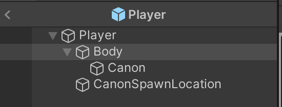

If you take a look, the CanonSpawnLocation object (which is used for both deciding where to spawn the canonballs and what the **direction** of their movement is) is not under the body. This means that when the body rotates, the spawner does not! Let's fixing that by moving the spawner to be under the body


Viola! A working moving, shooting, and rotating tank!

